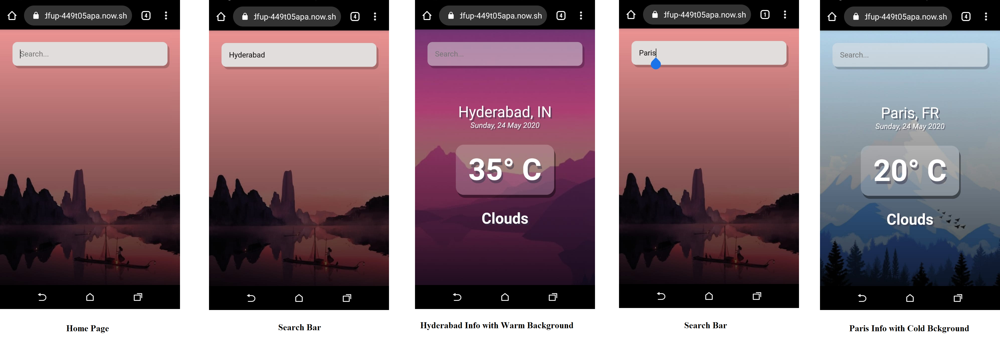

# React Weather App 

=======

> This is a basic React based Weather App that fetches Data from OpenWeatherMaps API and displays it.

---

### Table of Contents
You're sections headers will be used to reference location of destination.

- [Description](#description)
- [References](#references)
- [Author Info](#author-info)

---

## Description

This is a basic React based Weather App that fetches Data from OpenWeatherMaps API and displays it. It features a Search bar that takes in a City as a string and returns the corresponding weather from the Open Weather Maps API and accordingly on the basis of temperature, loads either the cold BG or Warm BG

#### Technologies

- React JS
- CSS

---

## References

#### API Reference

> API used: https://openweathermap.org/

---

## Author Info

- Instagram - [_robotic7o7_](https://instagram.com/_robotic7o7_)
- Website - [Rohan Christopher](https://bit.ly/RohanChristopher)

[Back To The Top](#read-me-template)
